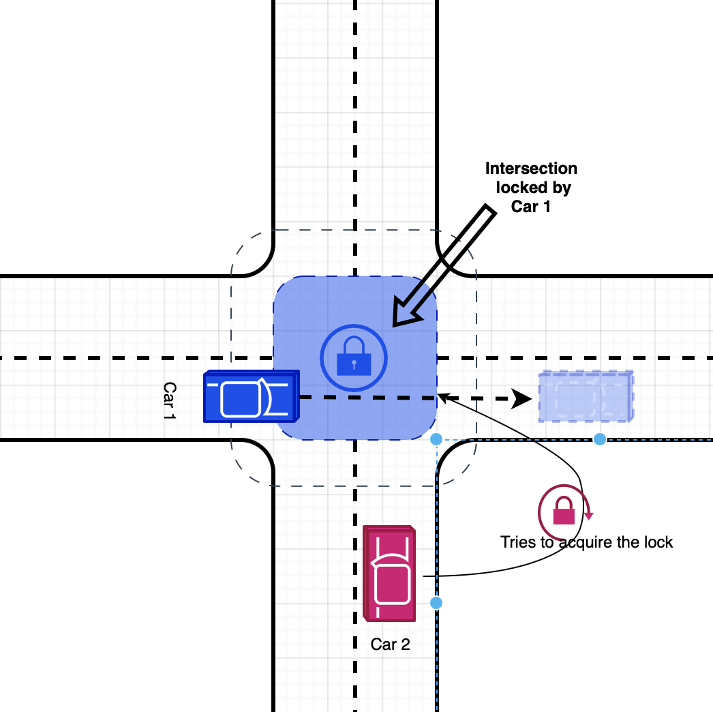
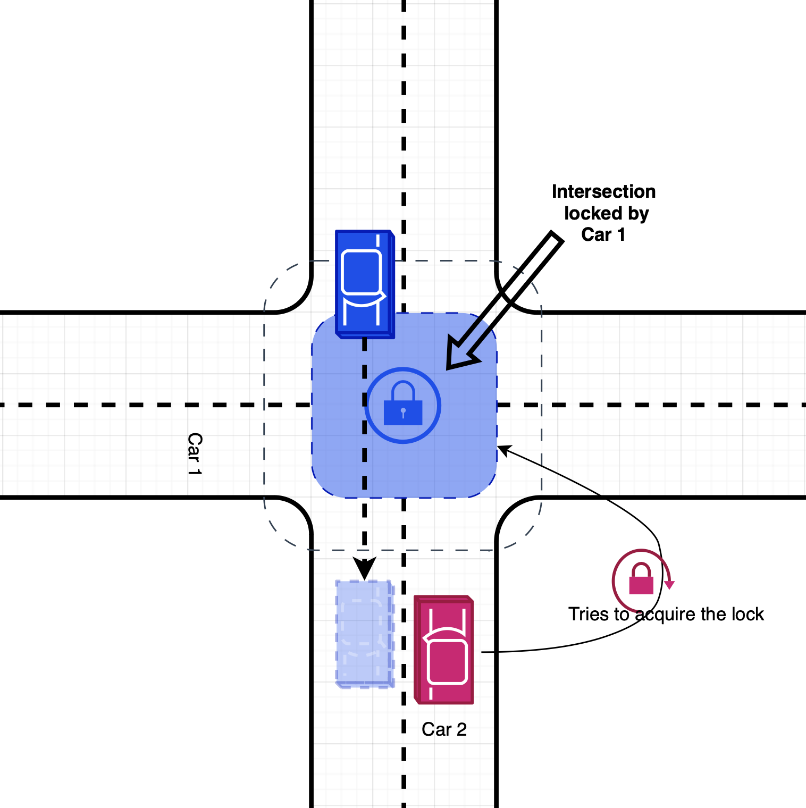
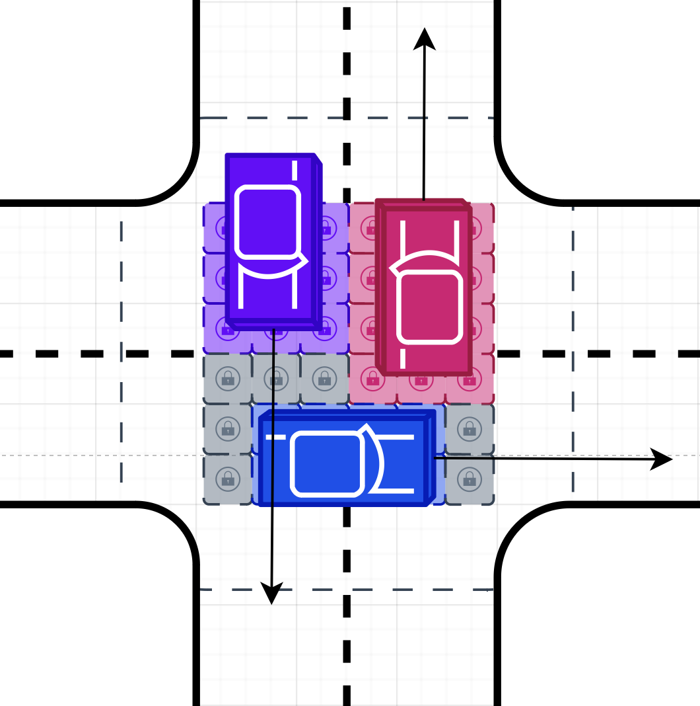

# Lease Management System for the Intersection Obstacle Avoidance Project at Zhejiang University -- University of Illinois Urbana-Champaign

## Introduction
**Algorithm Specification.**  
Our algorithm incorporates two subsystems: the lease-based scheduling subsystem and the planning subsystem. The scheduling algorithm employs a series of discrete snapshots capturing the intersection state at given timestamps. Each snapshot records the speed, location, type, and a unique identifier for every traffic participant. From this data, a lease, delineating the temporal duration of a vehicle's intersection occupancy, is created for each vehicle. A lease can be extended, canceled, or reapplied in response to unpredictable circumstances. The planning subsystem evaluates the lease assigned to each vehicle, modulating the vehicle's speed to adhere to the lease terms. In essence, the algorithm processes intersection snapshots as input to produce corresponding vehicle movements as output.

**Lease-based Scheduling Subsystem.**  
This subsection provides a comprehensive understanding of the elegance, simplicity, and adaptability of our solution. The ingenuity of our design stems from its ability to strike a balance between efficiency, safety, and timeliness depending on specific application scenarios and computational resources. Our design hinges on the proven and effective FIFO (First In First Out) algorithm \cite{coop-driving} used for obstacle avoidance.

    

        
    

    

        
    

    
Figure 1: FIFO Algorithm and Low-efficiency of the Lock Implementation

**The Lock-based Algorithm.**  
Previous algorithms metaphorically treat the intersection as a computer science lock. Vehicles attempt to acquire the lock before entering the intersection, delaying their entry if the lock is occupied (Figure 1). This one-at-a-time entry policy assures absolute safety. However, this straightforward approach presents a major drawback: the absence of scheduling capabilities, resulting in safety and efficiency issues. For instance:

- **Abrupt halts:** Vehicles cannot anticipate when a lock might be obtained by others, leading to sudden stops or reduced efficiency.
- **Efficiency conundrums:** Without advance knowledge of lock release, vehicles can't adjust their speed to seamlessly traverse the intersection immediately upon lock availability. This issue exacerbates traffic congestion under heavy traffic conditions.

##### Our Lease-based Algorithm.  
A lease is akin to a lock, supplemented with a conservative estimation of the duration when a traffic participant is expected to occupy a block. Traffic participants holding currently active leases are permitted to enter the intersections. Safety is guaranteed by ensuring leases do not overlap in time for conflicting paths in the intersection. Our lease-based approach grants a temporal window of safe intersection traversal to each vehicle, allowing them to adjust their speed in anticipation of their assigned lease and improve efficiency.

In a nutshell, every traffic participant's action will be divided into three phases depending on their location.

- Planning (before crossing the intersection)
- Crossing (inside the intersection)
- Post-crossing (after crossing the intersection)

**The Planning Phase.** In this phase, traffic participants will have two kinds of actions, depending on whether it has made a lease or not. Every traffic participant starts with no lease. To apply for a lease, they must follow these steps:

- Estimate the expected time of entering and leaving the intersection area.
- Check if there are any conflicting leases.
- If there are no conflicting leases, register its lease into etcd, using the expected time.
- Else, postpone its lease to the next available slot and register the lease into etcd.

These steps guarantee no two leases can overlap during the application phase. After a lease has been acquired, the traffic participant should constantly check the following:

- If the current lease can be brought forward? If yes, bring the lease forward to the first available slot. This step is necessary as sometimes, a previous lease can get canceled. In this case, we want to actively check if a lease can be put forward for efficiency concerns.
- Check if the current lease is still possible to satisfy within the car's mechanical capabilities. If it is impossible to catch up with a lease anymore or the lease has expired, we want to cancel the lease and reapply the lease.

**The Crossing Phase.** In this phase, traffic participants mainly do the following for lease management: 

- Check if its lease is about to expire. If yes, extend the lease and postpone other participants' leases if necessary, to avoid other participants from entering the intersection before completing leaving.

**The Post-crossing Phase.** In this phase, traffic participants mainly do the following for lease management: 

- Cancel the lease if it is still active. A lease might still be active after the participant has left the intersections because of many factors such as conservative time prediction. We want to cancel the lease early so that other traffic participants can bring their lease forward.

**Managing Non-V2V Traffic Participants.** Not all traffic participants are equipped with V2V communication capabilities and as such, they may be unable to apply for leases autonomously. In the event of a conflict, we prioritize non-V2V leases by postponing V2V leases instead. This strategy is implemented to minimize the impact of unpredictability from non-V2V participants.

**Enforcement**  
Once the lease for each vehicle is assigned, the planning subsystem acts as the intermediary between the lease-based scheduling subsystem and the physical layer of vehicle motors, regulating speed and trajectory to meet the scheduling requirements.

- **Planning:** If there is not a lease, the traffic participants should keep going at their current speed. If there is a lease, the participant changes its speed according to the requirement of the lease. If the participant is about to arrive at the intersection but still does not have a lease available, it stops until the leasing system makes a lease.
- **Crossing:** Keep its speed at the advised speed (often set by the government), and stop if the current lease is preempted by a non-V2V traffic participant.
- **Post-crossing:** Keep its speed at the advised speed (often set by the government)

The control subsystem and the leasing algorithm, together, will make intersection collision efficient and safe.

**Verification**  
To verify the properties of the system, we have designed 4 experiments. One for showing the efficiency of the algorithm, and two for showing the safety of the algorithm. The first one is a comparison experiment, the experiment setup contains two V2V vehicles trying to cross the intersection at the same time from different directions and compare the total time for both cars to cross the intersection under our lease-based scheduling algorithm and the lock-based algorithm. We show that our algorithm is consistently 30% faster. The second one consists of two V2V vehicles trying to cross the intersection at the same time. We show that the lease-based scheduling system can let both cars cross without crashing into each other. The third one consists of two V2V vehicles and one non-V2V vehicle trying

 to cross the intersection at the same time. We show that without V2V communication, the non-V2V vehicle will crash into the other V2V vehicle as due to visual obstacles, the two cars cannot see each other. However, with our algorithm and communication, the V2V vehicle can slow down to avoid collisions with the non-V2V vehicle. The fourth one consists of two V2V vehicles trying to cross the intersection at the same time. But before they cross, a sudden obstacle arises that blocks their way. We show that the vehicles can do emergency stops and can recover from expired leases right after the obstacle is cleared out of their way. During our tests of the system, we found that the above four experiments have a 100% success rate on all the experimental verifications.

**Engineering Feasibility and Future Improvements.**  
In this project, we have shown that the "lease" concept can have great potential in advanced intersection traffic scheduling with a minimum working example. Simple as it is, we want to show that the "lease" concept actually enables further space utilization optimization. For example, we can split the intersection into multiple blocks which have independent lease management systems, to increase the space utilization. Since lease application and the collision avoidance algorithm are largely limited by the accuracy of the prediction algorithm and the movement planning algorithm, the engineering team can easily, based on their specific needs, swap the existing prediction and movement planning algorithms with better ones or simpler ones to balance between performance and amount of computing resource available.

    
    
Figure 2: Design of an Improved Lease Algorithm

## Installation
The torch wheel to be used on Qcar is torch-1.10.0-cp36-cp36m-linux_aarch64.whl

### Utils

tmux send-keys -t foss:etcd 'echo hello qcar' C-m
